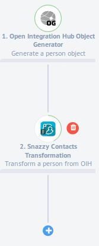

# oih-object-generator
> [Open Integration Hub](https://www.openintegrationhub.org/) Object Generator component for [elastic.io platform](http://www.elastic.io "elastic.io platform")

The idea behind  **Object Generator component** is just to generate a ___valid___ [Open Integration Hub](https://www.openintegrationhub.org/) object.
The component generates an object which should be verified against a certain transformer.

The component supports only **triggers** because of the fact the it must be used as a start point of your flow. Right after it comes the **transformer** which you want to test with the already generated object.

## Authentication

This component requires no authentication.

## How it works

At this point of time the **Object Generator component** supports one trigger for generating a ___valid___ [`person`](https://github.com/openintegrationhub/Data-and-Domain-Models/blob/master/src/main/schema/addresses/personV2.json) object.  

**Object Generator component** on [elastic.io](http://elastic.io) graphical interface:

1. Choose **Object Generator component**:  
  

2. Select a **trigger**:  

3. Generate a **sample**:  
  

4. Choose your **transformer**:  

5. Select an **action** in direction **'FROM'** [OIH](https://www.openintegrationhub.org/), because the generated object is a  ___valid___ [Open Integration Hub](https://www.openintegrationhub.org/) object, meaning that the **Transformer** expects an [OIH](https://www.openintegrationhub.org/) object.  

You can find out more information about our **Data Models** [here](https://github.com/openintegrationhub/Data-and-Domain-Models).

## License

Apache-2.0 © [Wice GmbH](https://wice.de/)
